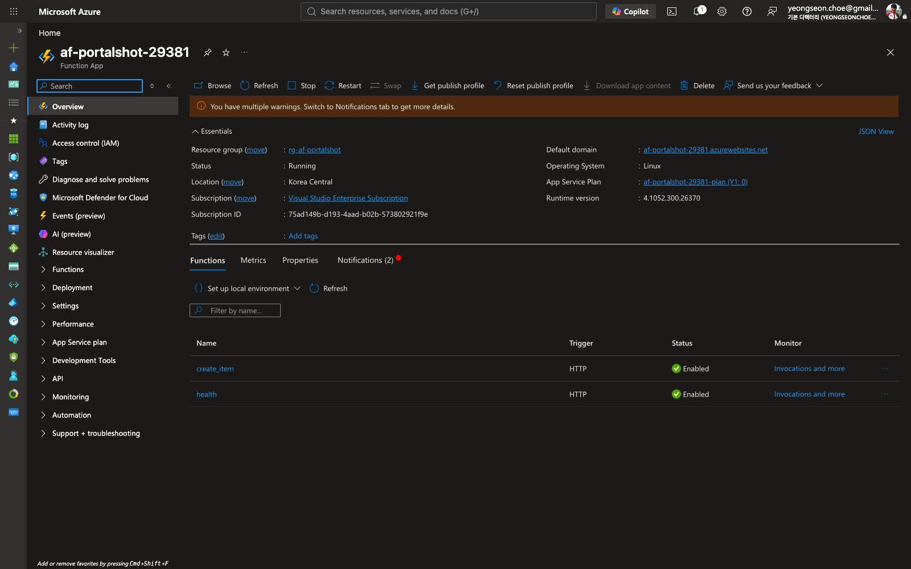
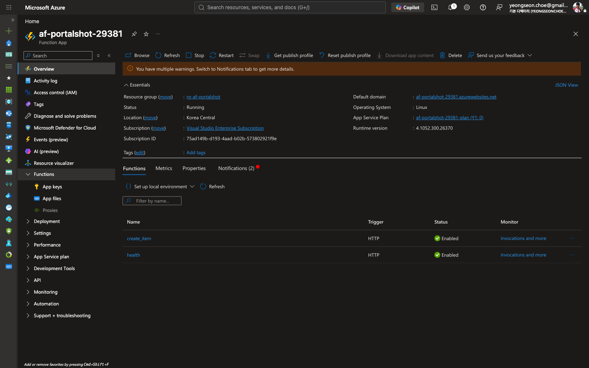

# Capturing and registering documentation screenshots

This runbook explains how to capture Azure Portal resource screenshots for a
deployed Function App and register them in the screenshot provenance pipeline so
that [`scripts/check_screenshots.py`](https://github.com/yeongseon/azure-functions-validation-python/blob/main/scripts/check_screenshots.py)
can detect when they go stale.

> **Why this is a manual step.** Azure Portal pages require an authenticated
> browser session (sign-in plus MFA), so portal *resource* screens cannot be
> captured headlessly in CI. The `e2e-azure` workflow captures live *endpoint*
> responses automatically, but the portal Overview/Functions views are captured
> by a maintainer following this guide.

## What the pipeline already gives you

- **Manifest** — [`docs/assets/screenshots.yml`](assets/screenshots.yml) records
  the provenance of every documentation screenshot. It is seeded **empty**
  (`screenshots: []`), which the checker treats as clean.
- **Checker** — `scripts/check_screenshots.py` hard-fails on missing images,
  missing inputs, and duplicate ids; it warns (or, with `--strict`, fails) when
  a screenshot's `source.inputs` change after capture.
- **PR gate** — [`.github/workflows/screenshots.yml`](https://github.com/yeongseon/azure-functions-validation-python/blob/main/.github/workflows/screenshots.yml)
  runs the checker on every pull request.

Adding a manifest entry **before** the PNG exists will (correctly) fail the
checker, so capture the image first, then register it.

## Step 1 — Have a Function App to capture

You need a deployed Function App resource in the portal. Either:

- Use an existing deployment you already have, **or**
- Follow [`docs/deployment.md`](deployment.md) to stand up a temporary Function
  App, capture the screenshots, then tear it down (see
  [Clean up resources](deployment.md#clean-up-resources)). Deleting the resource
  group afterward keeps this a one-time, non-billing verification — consistent
  with the [Verification status](deployment.md#verification-status) policy.

## Step 2 — Capture the portal screens

Sign in to [portal.azure.com](https://portal.azure.com), open your Function App
resource, and capture:

| Screen | Portal location | Suggested filename |
| --- | --- | --- |
| Overview | Function App → **Overview** | `docs/assets/portal-functionapp-overview.png` |
| Functions list | Function App → **Functions** | `docs/assets/portal-functionapp-functions.png` |

Before capturing, anonymize anything you would not publish: subscription id,
resource group names that leak internal detail, and the public app URL if it is
not already anonymized elsewhere in the docs.

Save the PNGs at the paths above (or paths of your choosing — just keep the
manifest `image` values in sync).

## Step 3 — Register each screenshot in the manifest

Add one entry per PNG to the `screenshots:` list in
[`docs/assets/screenshots.yml`](assets/screenshots.yml). Use this shape (leave
`source.hash` as a placeholder — Step 4 fills it in):

```yaml
screenshots:
  - id: portal-functionapp-overview
    image: docs/assets/portal-functionapp-overview.png
    captured:
      package_version: "0.11.2"      # output of `make version`
      git_sha: "<commit-sha>"        # commit the capture was taken against
      date: "2026-08-15"             # ISO-8601 capture date
      method: manual                 # portal captures are always "manual"
    source:
      inputs:
        - examples/e2e_app/function_app.py   # files whose change invalidates the shot
      hash: "sha256:0"               # placeholder; refreshed by --update
    output:
      hash: "sha256:0"               # placeholder; refreshed by --update
```

Field notes:

- **`source.inputs`** is the list of repo files whose change should flag the
  screenshot as stale. For a portal view of the deployed app, point it at the
  app definition (for example `examples/e2e_app/function_app.py`) so that
  changing the deployed functions re-flags the portal shots.
- **`captured.*`** fields are provenance only — they never drive staleness
  decisions. `source.hash` does.
- Every `id` must be unique across the manifest.

## Step 4 — Refresh hashes and verify

Recompute `source.hash` / `output.hash` from the files on disk, then run the
checker:

```bash
make screenshots-update   # rewrites hashes in docs/assets/screenshots.yml
make screenshots-check    # strict verification; must pass before you commit
```

`make screenshots-check` runs the checker with `--strict`, so any residual drift
fails the command. A clean run prints `Screenshot manifest OK: N screenshot(s)
verified.`

## Step 5 — Embed and open a PR

1. Reference the images where they are useful — typically in the
   [Verification status](deployment.md#verification-status) section of
   `docs/deployment.md`:

   ```markdown
   
   
   ```

2. Commit the PNGs, the manifest changes, and the docs edit together
   (`docs:` Conventional Commit) and open a PR. The
   [`screenshots` workflow](https://github.com/yeongseon/azure-functions-validation-python/blob/main/.github/workflows/screenshots.yml)
   re-runs the checker on the PR.

## When a screenshot goes stale

If you later change a file listed in an entry's `source.inputs`, the checker
warns that the capture no longer matches its source. Re-capture the affected
portal screen, replace the PNG, and re-run Step 4 to refresh the hashes.
